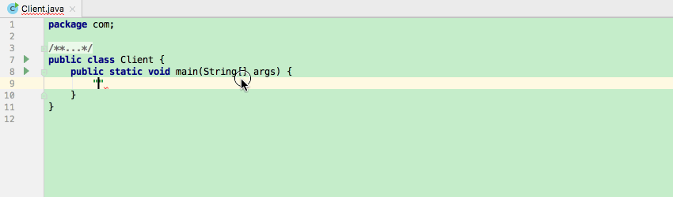
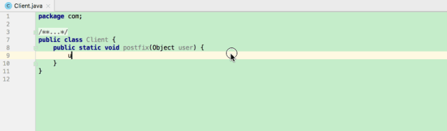
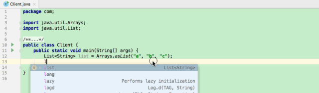
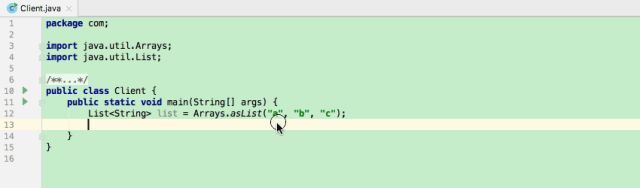
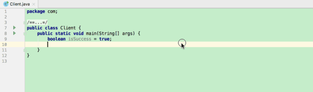
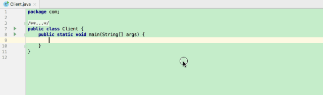
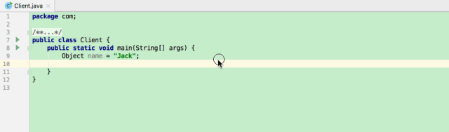
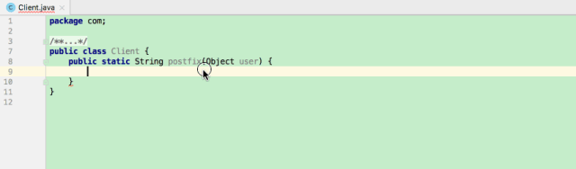

IDEA快捷键汇总

# 1. 后缀补全

1. var声明：给创建的对象快速起名称，例如`new Object().var`，然后按回车键，就可以获得IDEA快速推荐的一个名称。

   

2. null判空

   

3. 非null判断

   

   

4. for遍历

   

5. fori遍历

   

6. not 取反

   

7. if判断

   

8. cast 强转 

   

9. return返回

   

